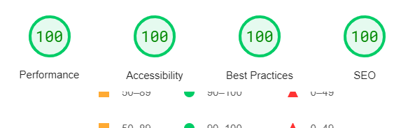

# Terminal Portfolio Website by Anirban Kar


I have created a terminal version of my portfolio website using Angular 15, which offers support for multiple themes and enables the use of keyboard shortcuts for certain functions.

## Features

- Responsive Design 📱💻
- Multiple themes 🎨
- Autocomplete feature ✨ (TAB | Ctrl + i)
- Go previous and next command ⬆️⬇️

## Tech Stack

**Frontend** - [Angular](https://angular.io/) 
**Styling** - [SCSS](https://sass-lang.com/)  
**UI/UX** - [Figma](https://figma.com/)  
**Deployment** - [Github Actions](https://github.com/features/actions), [Github Pages](https://pages.github.com/)

## Multiple Themes

Currently, this website supports 5 themes. Type `themes` in the terminal for more info.


## Lighthouse Score

<p align="center">

</p>


## Running Locally

Clone the project

```bash
git clone https://github.com/satnaing/terminal-portfolio.git
```

Go to the project directory

```bash
cd terminal-portfolio
```

Remove remote origin

```bash
git remote remove origin
```

Install dependencies

```bash
npm install
```

Start the server

```bash
npm start
```

## Inspiration and Credits

These following websites provided some inspiration for creating this type of terminal website. Only some features and functionalities are inspired by these following websites. All codes are written on my own.

- [Sat Naing](https://terminal.satnaing.dev/)
- [Forrest](https://fkcodes.com/)

## Author

- [Anirban kar](https://www.linkedin.com/in/anirban-kar-498027130/)
